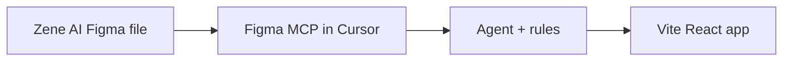

# Zene AI — Figma → React build plan

Design source: [Zene AI (Figma)](https://www.figma.com/design/itgCIed2YDmEN6B3Ks4o7y/Zene-AI?node-id=642-1289)  
Primary frame node: `642:1289` (see `figma.config.json`)

## Why the Figma plugin matters here

This workspace has **no app code yet** — only design in Figma. The Figma plugin’s MCP server is the bridge: it returns structured layout, tokens, and screenshots so the agent can scaffold React without manual export.

## MCP tools used per screen

| Step | Tool | Output |
|------|------|--------|
| Inventory | `get_metadata` | Page/frame list (XML) |
| Spec | `get_design_context` | React + Tailwind starting point |
| Tokens | `get_variable_defs` | Colors, type, spacing |
| QA | `get_screenshot` | Reference image |
| Assets | export via MCP | `public/assets/figma/` |

## Connect Figma MCP (one-time)

1. **Cursor Settings → MCP** → find **figma** → **Connect** (OAuth).
2. Or confirm `~/.cursor/mcp.json` includes `"figma": { "url": "https://mcp.figma.com/mcp" }` and restart Cursor.
3. In a new Agent chat, ask: *“Run whoami on Figma MCP”* — should return your Figma account.

## Next prompt after connect

Paste this in Agent chat:

> Read `figma.config.json`, run get_metadata on file `itgCIed2YDmEN6B3Ks4o7y`, then get_design_context and get_variable_defs for node 642:1289. Save tokens to `src/styles/tokens.css`, scaffold Vite+React+Tailwind, and implement the primary frame.

## Page 2 export (done)

Resolved "Page 2" as frame `Home 1` (`nodeId: 162:507`) and exported:

- Full frame screenshot: `public/assets/figma/page-2/page-2-full.png`
- Frame assets: `public/assets/figma/page-2/asset-01.png` ... `asset-40.png`
- Design context code (React+Tailwind reference): `docs/figma/page-2-design-context.tsx`
- Asset manifest (name -> remote URL -> local file): `docs/figma/page-2-assets-manifest.json`

## Status

- [x] Plugin enabled in `.cursor/settings.json`
- [x] `figma.config.json` + agent rules added
- [x] Figma MCP connected in this Cursor session
- [x] Page 2 frame inventory, screenshot, and assets pulled
- [ ] React app scaffolded and first screen built
